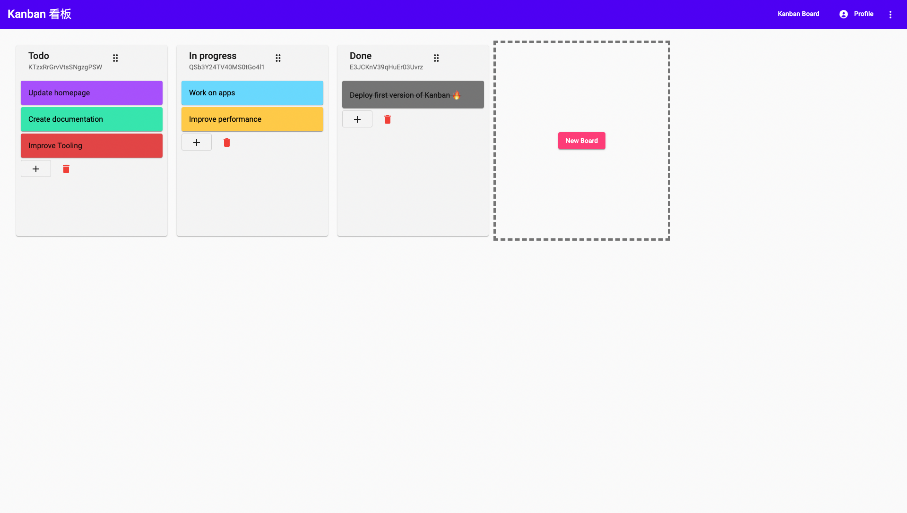

# Kanban 看板

<!-- PROJECT LOGO -->
<br />

<p align="center">
  <a href="https://github.com/Beomar97/kanban">
    
  </a>


  <h3 align="center">Kanban 看板</h3>

  <p align="center">
		Kanban storyboard app inspired by Trello. Based on the course by <a href="https://fireship.io/courses/angular/">Fireship</a>.
    <br />
    <a href="https://beomar97-kanban.web.app/"><strong>Explore the demo »</strong></a>
    <br />
    <br />
  </p>
</p>

<!-- TABLE OF CONTENTS -->

<details open="open">
  <summary><h2 style="display: inline-block">Table of Contents</h2></summary>
  <ol>
    <li><a href="#about-the-project">About The Project</a></li>
    <li><a href="#thesis">Thesis</a></li>
    <li><a href="#workspace">Workspace</a></li>
    <li><a href="#parameters">Parameters</a></li>
    <li><a href="#architecture">Architecture</a></li>
    <li><a href="#algorithms">Algorithms</a></li>
    <li><a href="#contact">Contact</a></li>
  </ol>
</details>

## About the Project
This project is a Kanban storyboard app inspired by [Trello](https://trello.com/en). The developed app is based on the course by [Fireship](https://fireship.io/courses/angular/), but changes and additional features have been added to the original implementation.



### Built With

- Angular
- Firebase

### Tooling

- Husky
- Prettier
- ESLint
- StyleLint

## Getting Started

To get a local copy up and running follow these simple steps.

### Prerequisites

- npm

  ```shell
  npm install npm@latest -g
  ```

- Angular CLI

  ```shell
  npm install -g @angular/cli
  ```

### Installation

1. Clone the project

   ```shell
   git clone https://github.com/Beomar97/kanban.git
   ```

2. Move to the just cloned repository

   ```shell
   cd kanban/
   ```

3. Install dependencies

   ```shell
   npm install
   ```

4. Serve the app locally

   ```shell
   npm run start
   ```

5. The app should now be locally available at `localhost:4200`

## CI/CD

- [Firebase Hosting](https://firebase.google.com/docs/hosting)

  Build automation and deployment was configured automatically with Firebase

- Triggers

  The app will be automatically deployed to Firebase Hosting on merge and PR via [GitHub Actions](https://github.com/Beomar97/kanban/actions).
